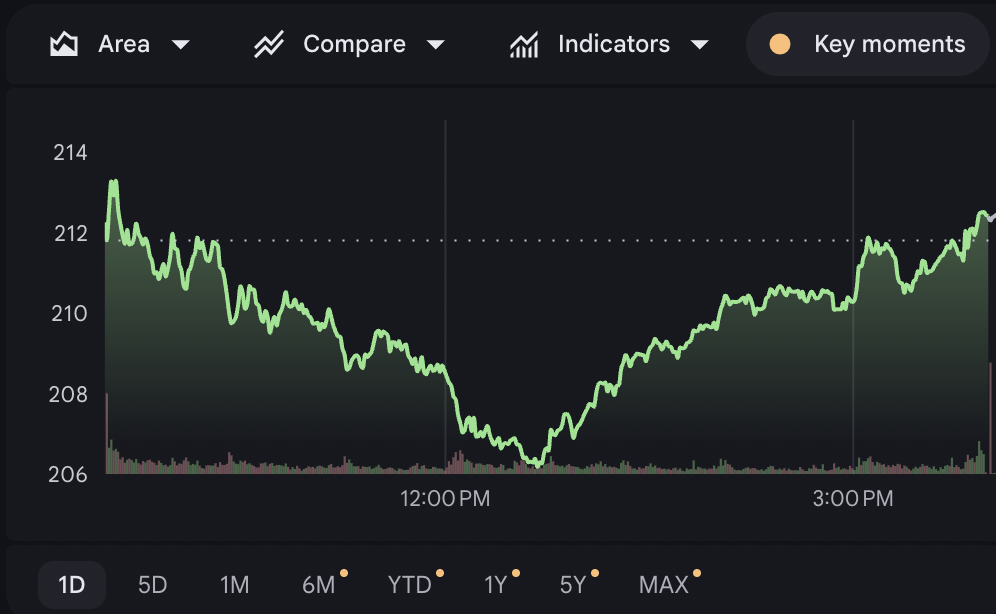

# Handoff: Journal Compare, Indicators, and Key Moments

> Packaged: 2026-07-17
>
> Status: Product inspiration captured; no UI implementation started
>
> Start here when continuing this work on another machine.

## Handoff Goal

Explore a new visual-analysis module for the Journal view, inspired by the
control layout and time navigation in Google Finance. The inspiration is the
interaction model—not the Google Finance branding or a literal stock-chart
clone.

The module could let a trader:

- Switch between a trend/area graph and a bar chart.
- Potentially use a third view when it answers a distinct review question.
- Compare performance with behavioral or trading indicators.
- Place important journal and trading moments on the same timeline.
- Change between Day, Week, Month, and Year review scopes.

## Original Thought

The user described this as a possible "new kind of dashboard implementation for
the journal view." The Google Finance screenshot felt relevant because it puts
chart configuration, comparisons, indicators, key moments, and time ranges into
one compact interface.

The phrase **Compare Indicators and Key Moments** was suggested as a possible
name. It is still ambiguous whether this should be:

- The title of the entire module.
- A clearer replacement for the reference's **Area** label.
- A description of several controls rather than a user-facing header.

Do not lock the naming until the information architecture is clearer.

## Reference Asset



- Repository file:
  [`assets/google-finance-chart-controls-reference.png`](assets/google-finance-chart-controls-reference.png)
- Original capture: 2026-07-15 at 2:54:52 PM.
- Dimensions: 996 × 614 px.
- SHA-256:
  `ee97558c69788b041443728374e42e26d624b635d3bb2828669d2da28e00fbfd`
- The image is retained only as a visual product reference.

## Canonical Notes and Context

Read these in order:

1. [`JOURNAL_COMPARE_INDICATORS_KEY_MOMENTS.md`](../../JOURNAL_COMPARE_INDICATORS_KEY_MOMENTS.md)
   — the canonical concept note, proposed controls, product fit, MVP, and open
   questions.
2. [`ANALYTICS_RESEARCH_PLAN.md`](../../../analytics/ANALYTICS_RESEARCH_PLAN.md)
   — defines the Journal-to-Analytics contract and the available/derivable
   diagnostic modules.
3. [`DASHBOARD_CONCEPT.md`](../../DASHBOARD_CONCEPT.md) — clarifies that the main
   Dashboard owns the live trading-day loop, while Journal owns durable
   reflection and Analytics owns full investigation.
4. [`DESIGN_SYSTEM_ONE_SHEET.md`](../../../design/DESIGN_SYSTEM_ONE_SHEET.md) —
   current visual-system rules and reusable primitives.

Relevant implementation starting points:

- [`src/components/TradeJournalReview.tsx`](../../../../src/components/TradeJournalReview.tsx)
  — current Journal day/week/month review behavior and ET date assumptions.
- [`src/components/CumulativePnlChart.tsx`](../../../../src/components/CumulativePnlChart.tsx)
  — existing week/month/year cumulative P&L chart and segmented time control.

## Decisions Already Captured

- This concept belongs in Journal only when it supports reflection: what
  mattered, when behavior changed, what else was happening, and whether the
  period differs from a baseline.
- The full investigation and large comparison surface still belong in
  Analytics.
- Start with a curated diagnostic set rather than a general-purpose chart
  builder.
- Trend/area and bars are the first two useful view types.
- A third view must earn its place. Calendar/heatmap and distribution are
  candidates, not decisions.
- Time scope changes aggregation, not merely the visible date window.
- Key moments must work without color alone and should cluster when dense.
- The visual needs a short written takeaway for accessibility and scanability.
- Preserve account scoping and Eastern Time date behavior.

## Open Product Decisions

1. Does this replace a current Journal visualization or become a new section?
2. What is the module's user-facing name?
3. Which one comparison is valuable enough for the first version?
4. Are key moments system-generated, user-authored, or both?
5. At Day scope, does the x-axis represent clock time, executions/trades, or a
   hybrid?
6. Is the third view a calendar/heatmap, a distribution, or unnecessary?
7. Should the first prototype cover all four scopes or prove the model with
   Week and Month first?

## Recommended Next Step

Create one low-fidelity interaction concept using real Journal data shapes
before changing production code. Show:

- A quiet configuration toolbar.
- Trend and Bars toggles.
- One primary measure and one comparison.
- Two or three distinct key-moment markers.
- Day / Week / Month / Year scope controls.
- The written takeaway and **Open in Analytics** path.
- Desktop and narrow-screen control behavior.

Use the prototype to answer the naming, placement, first comparison, and Day
axis questions. If implementation is requested immediately, keep the first diff
small and reuse existing chart and segmented-control patterns.

## Current Repository State

At packaging time:

- The canonical concept note had been added.
- The Analytics research plan had been updated with a link to it.
- This reference asset and handoff bundle were added.
- No production components, routes, data contracts, or database schema were
  changed for this concept.
- No dependency was added.
- Verification was not required for the documentation and image-only changes.

There were pre-existing unrelated working-tree changes to `.env.example` and
`next-env.d.ts`; they are not part of this handoff and should remain untouched.

## Copy-Paste Continuation Prompt

```text
Continue the Journal visual-analysis concept from
docs/product/handoffs/2026-07-journal-compare-dashboard/README.md.

Read the linked canonical concept note, analytics plan context, dashboard
boundary, and design-system one-sheet before acting. Treat the included Google
Finance screenshot as interaction inspiration only. Preserve the existing
Journal behavior, account scoping, ET date handling, and the boundary where
Journal supports reflection while Analytics owns deep investigation.

First inspect the current Journal component tree and existing cumulative P&L
chart. Then help me [explore a prototype / refine the product spec / implement
the smallest useful version]. Keep changes targeted and call out which open
product decisions need my judgment.
```

Replace the bracketed phrase with the desired next task.
